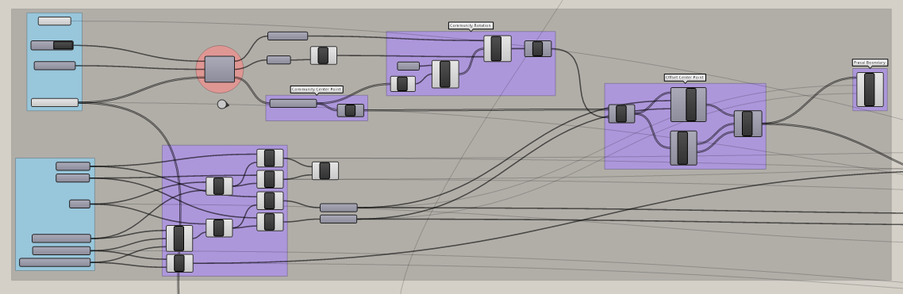
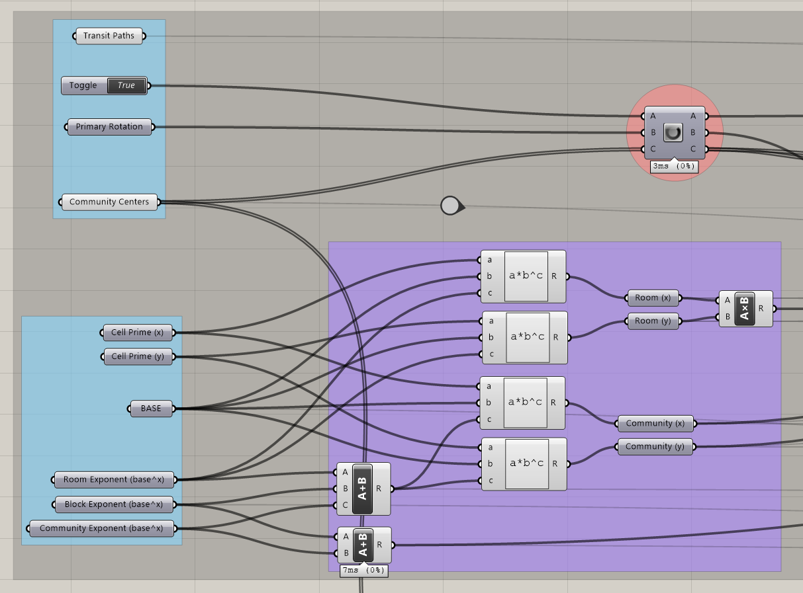
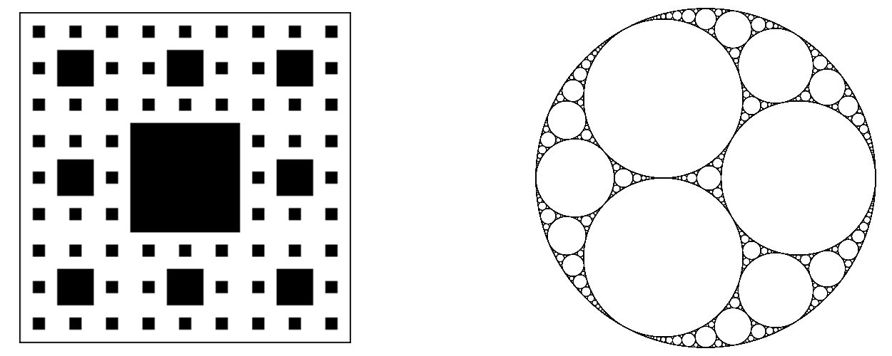
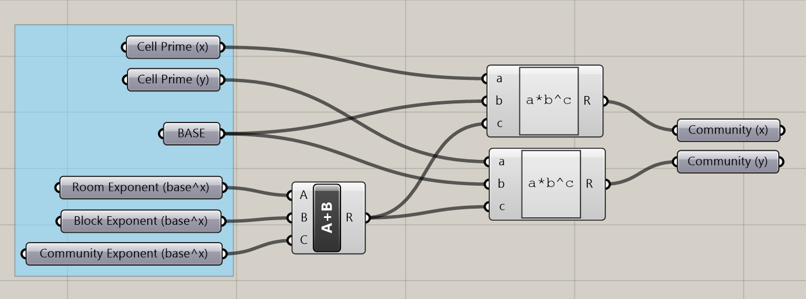
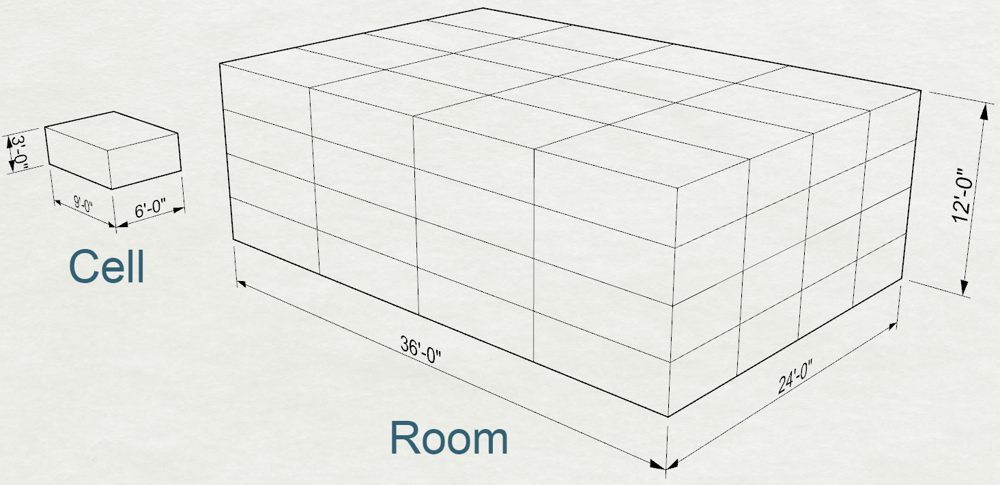
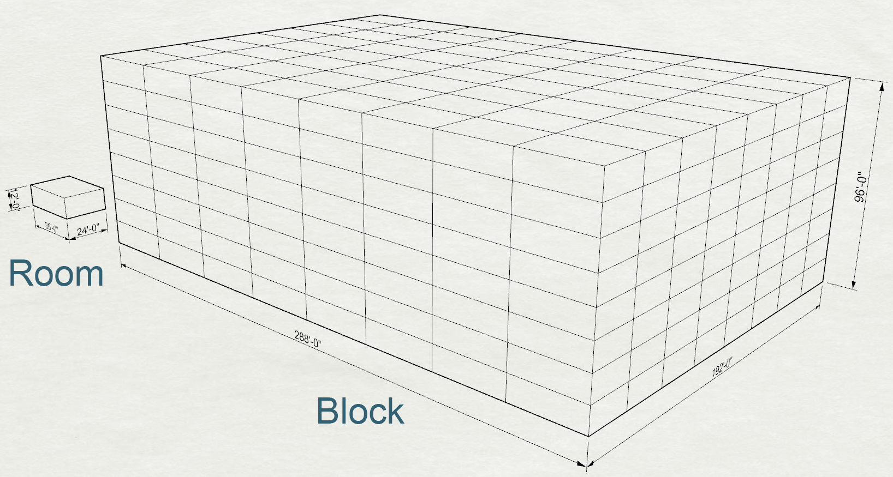

# A Fractal Community
## Building a Flexible Model for Urban Visioning
---

### Step One: Create dimensional Cell and iteration pattern

#### Summary
This step can be used to define the locations and rotations of the communities in the model. It can also be used to determine the size of the Cell, Room, Block, and Community modules and the underlying iteration pattern used to construct the communities. 

####Inputs (Blue Groups)
- **Transit Paths** - A curve or list of curves representing the transit network connecting all communities in the model.
 - We will not use the Transit Paths in this step, but we set them now for convenience. They will be used in step three. 
- **Boolean Toggle** - Use the Primary Rotation supplied below if set to True. If False, a random rotation will be supplied. 
- **Primary Rotation** - A list of numbers representing degrees of rotation corresponding to each of the communities in the model. 
- **Community Centers** - A list of points representing the center point of each community.
- **Cell Prime X** - The base modular dimension of the x-axis.
- **Cell Prime Y** - The base modular dimension of the y-axis.
- **Base** - The base number for the fractal doubling.
- **Room Exponent** - The exponent used to calculate the Room size from the Cell size.
- **Block Exponent** - The exponent used to calculate the Block size from the Room size.
- **Community Exponent** - The exponent used to calculate the Community size from the Block size.

#### A Primer on Fractals

>"A fractal is a natural phenomenon or a mathematical set that exhibits a repeating pattern that displays at every scale. It is also known as expanding symmetry or evolving symmetry" [^1]

To examples of fractals that relate well to what we're doing here are the [Seirpinski Carpet](https://en.wikipedia.org/wiki/Sierpinski_carpet) and the [Apollonian Gasket](https://en.wikipedia.org/wiki/Apollonian_gasket).

The Seirpinsky Square is constructed by subdividing a square into a grid of 9, discarding the center, and repeating the pattern to the remaining squares in the grid. In this way, the pattern can repeat infinitely and is present at every scale. 

#### The Basic Inputs

In this step, we will first create a plane representing each community with Community Centers as the origin and Primary Rotation as the plane's orientation.

We will also define the Primary Cell dimensions and the size of the Room, Block, and Community modules. 

We will start by defining a cubic module or cell that will serve as the "prime factor" [^2] of dimensions in the project. While, these dimensions do not need to be prime numbers for the model to work, it is useful to think of them as prime numbers conceptually. You could also compare this module to a cell, a pixel, an atom, or a grain of sand. It is the smallest unit. 

The Cell is defined by its X, Y, and Z-axis in feet. These variables are called Cell Prime X, Cell Prime Y, and Cell Prime Z, see inputs above. We will use X=9, Y=6, and Z=3. 

The Base variable represents the number of times the Cell will be duplicated in each iteration of the pattern. We will use Base = 2; for each iteration, the number of Cells in the X and Y-Axis double. If Base = 3, they would triple with each iteration. 

The Room, Block, and Community Exponent variables indicate the number of iterations the pattern will go through in order to define a Room, Block, or Community.

Therefore, we can find the number of cells along any axis by:

$$
Number\ of\ Prime\ Cells = Base ^ {Exponent}
$$

$$
Number\ of\ Prime\ Cells = 2^{1,\ 2,\ 3,\ 4...} = 2,\ 4,\ 8,\ 16...
$$

And to find an X-axis or Y-axis dimension the Cell Prime value is multiplied the total number of repetitions: 
$$
YAxis\ Dim. = Cell\ Prime \times Base ^ {Exponent}
$$

The exponent variables Room, Block, and Community represent specific numbers of iterations with Room being the first after Cell, followed by Block, and lastly Community. These variables are additive, so Block Exponent represents the number of iterations required to get to one from the lower step:

- Room Exponent: the number of iterations to go from Cell to Room. Use 2.
- Block Exponent: the number of iterations to go from Room to Block. Use 4.
- Community Exponent: the number of iterations to go from Block to Community. Use 3.

To find the total Y-axis dimensions of the Block and Community modules, we need to add the successive exponents to reach it: 

$$
Block\ YAxis\ Dim. = Cell\ Prime \times Base ^ {Room+Block}
$$
$$
Community\ YAxis\ Dim. = Cell\ Prime \times Base ^ {Room+Block+Community}
$$

In Grasshopper, calculating the Community dimensions looks like this:

And the modules look like this:

Now that we have calculated the modular dimensions of the Community we can start creating the fractal grid.

###Citations:

[^1] [ Wikipedia, Fractal.](https://en.wikipedia.org/wiki/Fractal)

[^2] [Prime Factorization](http://www.mathsisfun.com/prime-factorization.html)
