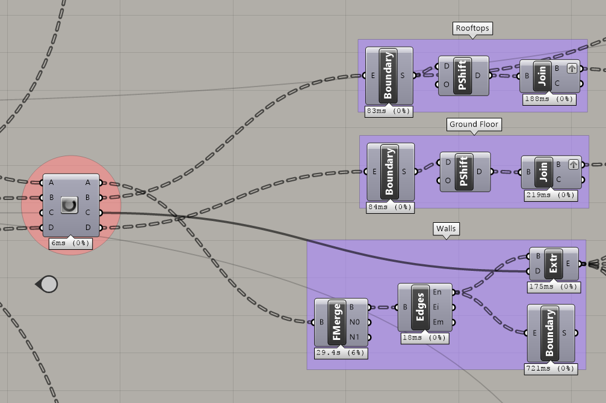

# A Fractal Community
## Building a Flexibile Model for Urban Visioning 
---

### Step Ten: Create visible 3-D geometry

#### Summary
This step will create the physical geometry of the model. Up to this point, all data in the model has existed as numbers, points, and curves, which enables the model to be very responsive and fast. 

#### Inputs
- Floor to Floor Height
- Room Rectangles
- Number of Floors per Room

### Array
The first step is to array the Room Rectangles vertically according to the Floor to Floor height the number of times specified in the Number of Floors per Room list. Next we will shift that list to create three lists. The first list is the Rooftop Rectangles. The last item in each list is the top floor associated with a Room and by offsetting those rectangles by the Floor to Floor Height we create the Rooftop Rectangles. The second is a list of the first floor associated with each Room. This is simply selecting the first item in each list. Lastly, we create a list of Rooms by Floor from the list of Floors by Room. This is a simple matrix transformation. See below. 

### Roofs, Walls, and Floors
The last step in this model is the creating of the actual surfaces for baking. The creation of ground floors and rooftops simply requires creating a surface from a boundary curve from our Rooftop and first floor lists.

The creating of walls requires making merged surfaces of all of the Rooms by Floor, extracting the edges, and extruding those edges according to the Floor to Floor Height. 

