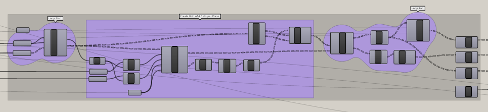

# A Fractal Community
## Building a Flexible Model for Urban Visioning
---

### Step Two: Build up a fractal grid of Rooms

#### Summary

This step will utilize looping nodes provided by Anenome, the Grasshopper Plugin, to create a fractal grid pattern.

#### Inputs

- **Number of Iterations** - Block Exponent + Community Exponent - 1. The Room Exponent is not included because we will be working at the Room module. The model could be taken to the Cell level, but the added resolution is not useful for this exercise. Subtract 1 because Grasshopper starts at 0 not 1.
- **Community Planes** - Created in step on. Contains the rotation of the community and is offset from the origin. 
- **Community Length** - X-axis dimension of the Community.
- **Community Width** - Y-axis dimension of the Community.
- **Base** - From Step 1.

### Recursion

This is where the underlying fractal ordering is created. A loop is created in Grasshopper that will complete the specified Number of Iterations. The process inside the loop is as follows:

- Look for supplied planes.

- Construct a grid of rectangles at planes supplied with:
 - Extent X and Extent Y - The number of rectangles to construct in the grid in the X and Y-axis. Use the Base variable, just as we used Base to construct the overall dimension. In the case that Base = 2, a 2 x 2 grid will be created.
 - Size X and Size y -  The X and Y-axis dimensions of the rectangles to be created. Notice the similarities to the equation we used to construct the Community module. In this case, for each iteration we are creating a grid of rectangles with dimensions that will diminish with each iteration.

$$
SizeX= {Community\ Length \over {Base^{Count+1}}}
$$
 
$$
SizeY= {Community\ Width \over {Base^{Count+1}}}
$$

- Find the origin plane of each created rectangle and assign the rotation of the supplied planes.
- Output modified planes
- Output the resulting grid of rectangles.

The loop is completed by feeding the resulting planes back into the loop. 

### Results

That is a bit technical, but what it will create is a nested series of 2 x 2 grids, each one inside the other. In grasshopper it looks like this:

We can see that with every iteration a new level is created `{A;B}(i)` becomes `{A;B;C}(i)`. Each item is grafted and becomes a branch of 4 items. Here are 4 iterations shown in Rhino. 

Now that the base grid pattern is created, we can begin to calculate individual block sizes based on proximity to indicated landmarks and paths. But first, we need to touch on calculating energy metrics to determine the sustainable size of the community. 