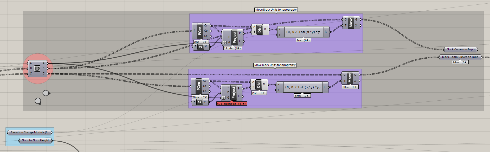

# A Fractal Community
## Building a Flexible Model for Urban Visioning
---

### Step Six: Project urban grid onto a given topography

#### Summary
This step will project both the Block rectangles and Room rectangles to topography. This model uses a randomly generated topography, but could work just as well with other geometry.

#### Inputs
- Topography
- Block rectangles
- Room rectangles

### Projection

This step finds the center point of the rectangles and projects them onto the supplied topography. The Z-axis dimension of the new point locations is then converted to a factor of the Elevation Change Module. This allows the user to control the elevation to avoid fractional distances. In this model the Elevation Change Module is set to 12 feet.