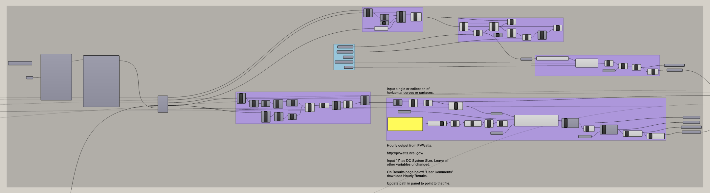
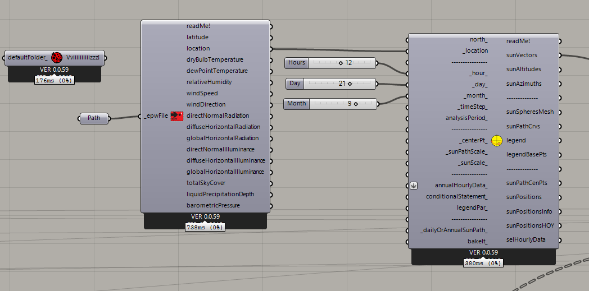

# A Fractal Community
## Building a Flexible Model for Urban Visioning
---

### Step Nine: Calculate renewable electricity generation

#### Summary
This step contains much of the same content as Step 3, except that it uses actual rooftop area to calculate solar generation. 

#### Inputs
- Rooftop Rectangles - The last rectangle in the room lists offset vertically by the Floor to Floor height.
- Community Boundary
- Topography
- Resource Boundary Radius
- Sun Vector
- Required Area Beyond Resource Boundary

### Solar Evaluation
This step will evaluate the provided Rooftop Rectangles to determine if they are in shade at a specific time. If the rectangles are shaded they will not be used to calculate PV solar generation. 

To do this, we use a .EPW weather file and the Ladybug plug-in to calculate a vector that represents the Altitude and Azimuth of the sun at a specific time and date. 

Lastly, we use the Occlusion node to test the Rooftop Rectangles with the sun angle. We use the Rooftops as the receiving surfaces as well as the shading surfaces. 

### The Rest
The rest of the step is nearly identical to Step 3. For more explanation, refer to that page. The only significant difference is that the results of the solar generation are broken down into Hourly, Daily, Monthly, and Annual totals. 