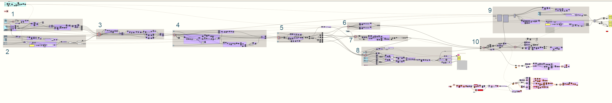

# A Fractal Community
### Building a Flexibile Model for Urban Visioning in Grasshopper
---

### Overview

Using the mutually-understandable visual language of 3-D modeling to design alternate future scenarios and interventions for social, economic, and environmental transformations.

This paper will break down and explain the logical steps and processes used in building a fractal urban community in grasshopper. 

**The 10 Steps in the Grasshopper Model**
1. Create dimensional module and fractal steps.
2. Create a community boundary based a given resource boundary.
3. Build up a fractal grid of Rooms from steps 1 and 2.
4. Step down the fractal grid to create Blocks in an urban grid.
5. Discard specific Rooms and Blocks.
6. Project urban grid onto a given topography.
7. Construct rooftop articulation.
8. Layer Block levels to meet target density.
9. Calculate renewable electricity generation.
10. Create visible 3-D geometry.

