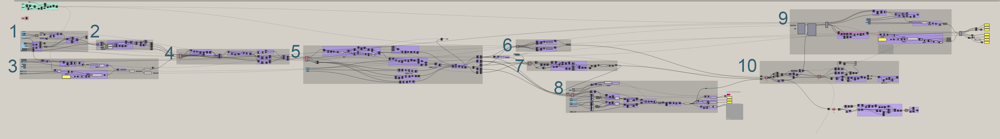

## Building a Flexible Model for Urban Visioning 
---

### Overview

The goal of this model is to use the visual language of 3-D modeling to design and illustrate alternate future scenarios and interventions for social, economic, and environmental transformations. Traditional design process modeling techniques would require hours or days to model and evaluate alternative form and pattern iterations. However, by using Grasshopper for Rhino, such iterations take only minutes to create; enabling their evaluation to become an integral part of the design process. 

Moreover, Grasshopper provides the ability to access and manipulate data in a way that would be impossible traditionally. For example, Grasshopper can be used to calculate the required height of each building in a community given a target density and a priority weight for each urban block. This would be difficult, if not impossible, to do by hand and would require subjective guesswork to come close to a dependable predictive value. Such tasks take less than 1 second in Grasshopper.

### Outline

This paper will explain the logical steps and processes used in building a fractal urban community in grasshopper. 

>The Grasshopper model in its entirety.

**The 10 Steps in the Grasshopper Model**
1. Create dimensional Cell and iteration pattern.
2. Build up a fractal grid of Rooms.
3. Create a community boundary based a given resource boundary.
4. Step down the fractal grid to create Blocks in an urban grid.
5. Discard specific Rooms and Blocks.
6. Project urban grid onto a given topography.
7. Construct rooftop articulation.
8. Layer Block levels to meet target density.
9. Calculate renewable electricity generation.
10. Create visible 3-D geometry.

