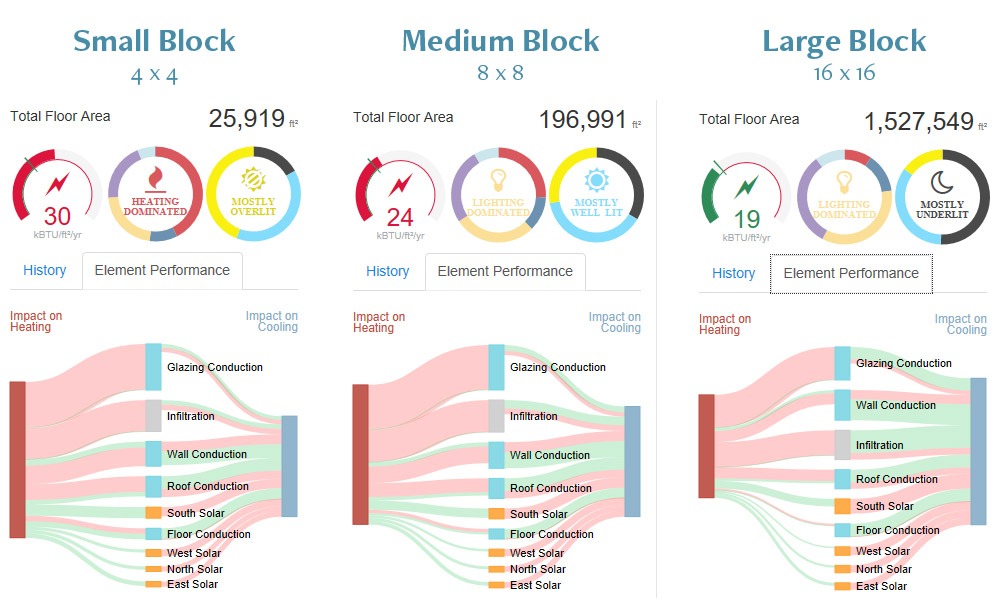
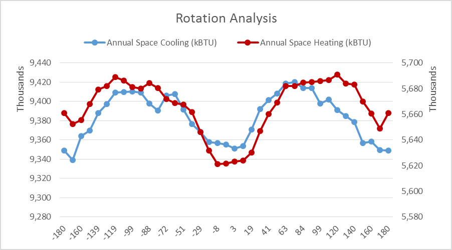
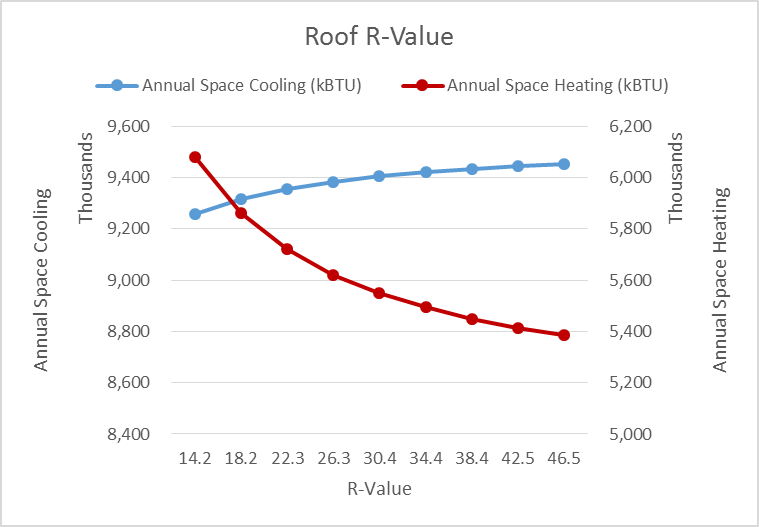
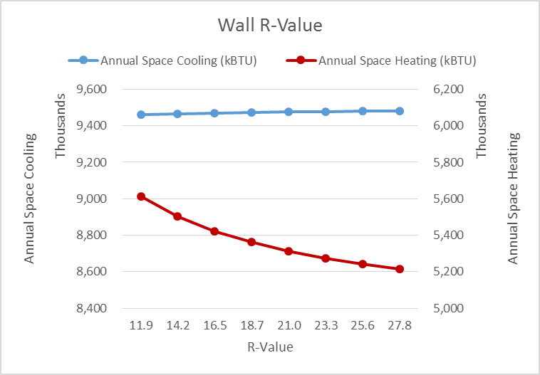
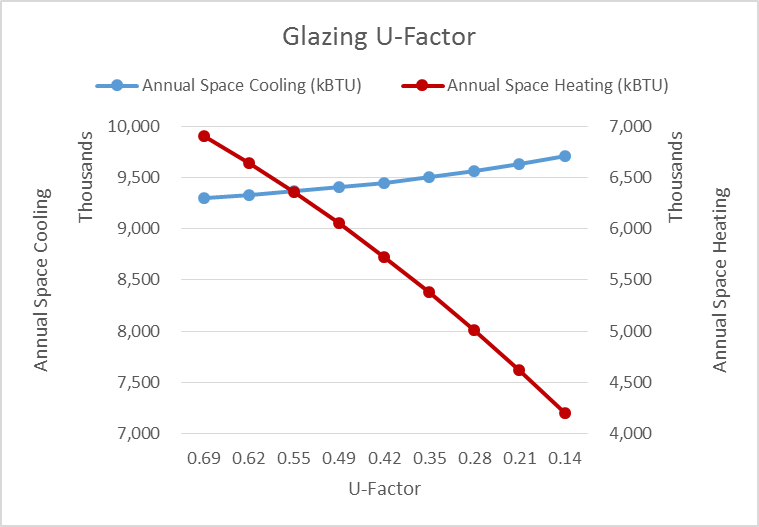
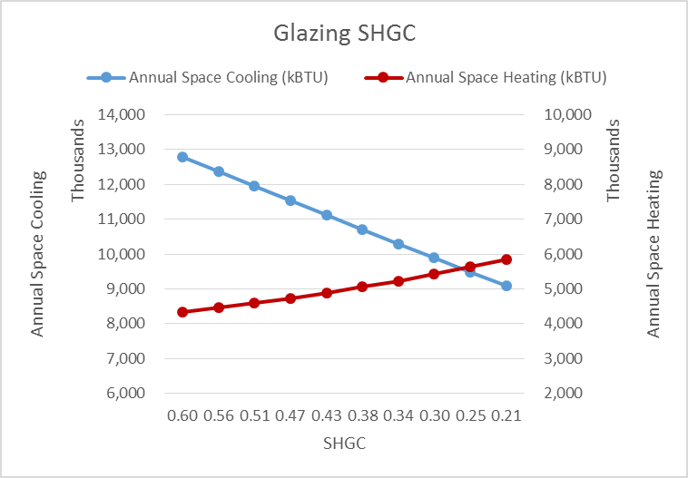
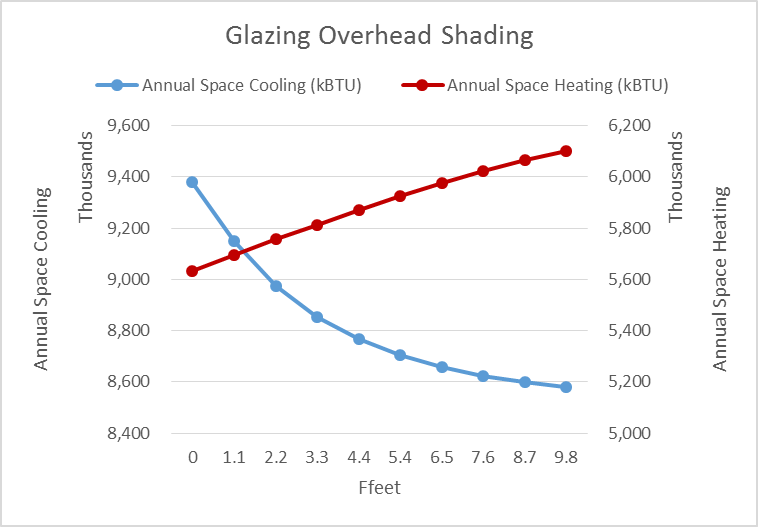
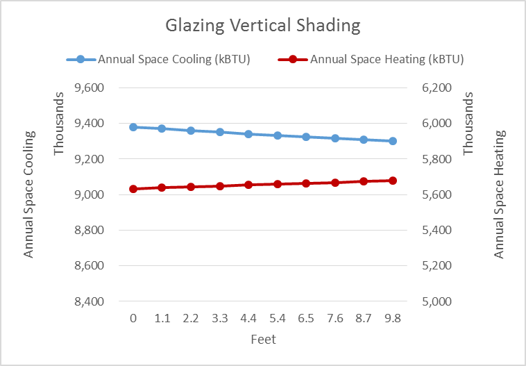

# Performance

##Large Block 
###Rotation Analysis

|                        | *Annual Space Cooling (kBTU)* | *Annual Space Heating (kBTU)* |
|------------------------|-------------------------------|-------------------------------|
| **Mean**               | **9,383,714**                 | **5,665,361**                 |
| Standard Error         | 3,887.11                      | 3,406.86                      |
| Median                 | 9,390,389                     | 5,669,037                     |
| Mode                   | 9,348,786                     | 5,661,078                     |
| **Standard Deviation** | **24,275**                    | **21,276**                    |
| **Range**              | **81,044**                    | **69,814**                    |
| **Minimum**            | **9,339,003**                 | **5,621,056**                 |
| **Maximum**            | **9,420,047**                 | **5,690,870**                 |
| Count                  | 39                            | 39                            |

###Roof R-Value

| Roof R-Value (ft2 h °F/BTU) | Annual Space Cooling (kBTU) | Annual Space Heating (kBTU) | Aggregate (kBTU) | Margin (kBTU) | Marginal Rate (margin/prev) |
|----------------------------------------|-----------------------------|-----------------------------|------------------|---------------|-----------------------------|
| 14.2                                   | 9,258,728                   | 6,082,157                   | 15,340,885       |               |                             |
| 18.2                                   | 9,317,665                   | 5,861,826                   | 15,179,491       | (161,394)     | -1.05%                      |
| 22.3                                   | 9,356,563                   | 5,720,354                   | 15,076,917       | (102,574)     | -0.68%                      |
| 26.3                                   | 9,384,195                   | 5,621,997                   | 15,006,192       | (70,725)      | -0.47%                      |
| 30.4                                   | 9,404,826                   | 5,549,630                   | 14,954,456       | (51,736)      | -0.34%                      |
| 34.4                                   | 9,420,847                   | 5,494,261                   | 14,915,108       | (39,348)      | -0.26%                      |
| 38.4                                   | 9,433,630                   | 5,450,477                   | 14,884,107       | (31,001)      | -0.21%                      |
| 42.5                                   | 9,444,059                   | 5,414,962                   | 14,859,021       | (25,086)      | -0.17%                      |
| 46.5                                   | 9,452,747                   | 5,385,633                   | 14,838,380       | (20,641)      | -0.14%                      |

###Wall R-Value

| Wall R-Value (ft2 h °F/BTU) | Annual Space Cooling (kBTU) | Annual Space Heating (kBTU) | Aggregate (kBTU) | Margin (kBTU) | Marginal Rate (margin/prev) |
|-----------------------------|-----------------------------|-----------------------------|------------------|---------------|-----------------------------|
| 9.7                         | 9,454,148                   | 5,771,637                   | 15,225,785       |               |                             |
| 11.9                        | 9,461,184                   | 5,612,925                   | 15,074,109       | (151,676)     | -1.00%                      |
| 14.2                        | 9,466,395                   | 5,503,174                   | 14,969,569       | (104,540)     | -0.69%                      |
| 16.5                        | 9,470,432                   | 5,422,886                   | 14,893,318       | (76,251)      | -0.51%                      |
| 18.7                        | 9,473,599                   | 5,361,449                   | 14,835,048       | (58,270)      | -0.39%                      |
| 21.0                        | 9,476,149                   | 5,312,916                   | 14,789,065       | (45,983)      | -0.31%                      |
| 23.3                        | 9,478,246                   | 5,273,619                   | 14,751,865       | (37,200)      | -0.25%                      |
| 25.6                        | 9,479,995                   | 5,241,123                   | 14,721,118       | (30,747)      | -0.21%                      |
| 27.8                        | 9,481,479                   | 5,213,820                   | 14,695,299       | (25,819)      | -0.18%                      |

###Glazing U-Factor

| Facade Glazing U-Factor (BTU/ft2 h °F) | Annual Space Cooling (kBTU) | Annual Space Heating (kBTU) | Aggregate (kBTU) | Margin (kBTU) | Marginal Rate (margin/prev) |
|----------------------------------------|-----------------------------|-----------------------------|------------------|---------------|-----------------------------|
| 0.69                                   | 9,295,991                   | 6,904,957                   | 16,200,948       |               |                             |
| 0.62                                   | 9,328,146                   | 6,637,874                   | 15,966,020       | (234,928)     | -1.45%                      |
| 0.55                                   | 9,363,970                   | 6,353,576                   | 15,717,546       | (248,474)     | -1.56%                      |
| 0.49                                   | 9,403,864                   | 6,049,747                   | 15,453,611       | (263,935)     | -1.68%                      |
| 0.42                                   | 9,448,560                   | 5,724,593                   | 15,173,153       | (280,458)     | -1.81%                      |
| 0.35                                   | 9,499,566                   | 5,378,276                   | 14,877,842       | (295,311)     | -1.95%                      |
| 0.28                                   | 9,557,959                   | 5,008,460                   | 14,566,419       | (311,423)     | -2.09%                      |
| 0.21                                   | 9,626,125                   | 4,616,211                   | 14,242,336       | (324,083)     | -2.22%                      |
| 0.14                                   | 9,706,055                   | 4,199,683                   | 13,905,738       | (336,598)     | -2.36%                      |

###Glazing Solar Heat Gain Coefficient (SHGC)

| Facade Glazing SHGC | Annual Space Cooling (kBTU) | Annual Space Heating (kBTU) | Aggregate (kBTU) | Margin (kBTU) | Marginal Rate (margin/prev) |
|---------------------|-----------------------------|-----------------------------|------------------|---------------|-----------------------------|
| 0.60                | 12,794,774                  | 4,339,136                   | 17,133,910       |               |                             |
| 0.56                | 12,370,279                  | 4,460,231                   | 16,830,510       | (303,400)     | -1.77%                      |
| 0.51                | 11,948,923                  | 4,592,401                   | 16,541,324       | (289,186)     | -1.72%                      |
| 0.47                | 11,530,533                  | 4,735,041                   | 16,265,574       | (275,750)     | -1.67%                      |
| 0.43                | 11,115,561                  | 4,889,742                   | 16,005,303       | (260,271)     | -1.60%                      |
| 0.38                | 10,703,237                  | 5,053,791                   | 15,757,028       | (248,275)     | -1.55%                      |
| 0.34                | 10,294,458                  | 5,230,352                   | 15,524,810       | (232,218)     | -1.47%                      |
| 0.30                | 9,890,323                   | 5,423,303                   | 15,313,626       | (211,184)     | -1.36%                      |
| 0.25                | 9,490,233                   | 5,630,530                   | 15,120,763       | (192,863)     | -1.26%                      |
| 0.21                | 9,094,897                   | 5,854,538                   | 14,949,435       | (171,328)     | -1.13%                      |

###Glazing Overhead Shading

| Horizontal Projection (ft) | Annual Space Cooling (kBTU) | Annual Space Heating (kBTU) | Aggregate (kBTU) | Margin (kBTU) | Marginal Rate (margin/prev) |
|----------------------------|-----------------------------|-----------------------------|------------------|---------------|-----------------------------|
| 0                          | 9,381,212                   | 5,632,554                   | 15,013,766       |               |                             |
| 1.1                        | 9,150,029                   | 5,694,871                   | 14,844,900       | (168,866)     | -1.12%                      |
| 2.2                        | 8,974,100                   | 5,756,098                   | 14,730,198       | (114,702)     | -0.77%                      |
| 3.3                        | 8,854,398                   | 5,813,797                   | 14,668,195       | (62,003)      | -0.42%                      |
| 4.4                        | 8,768,400                   | 5,870,382                   | 14,638,782       | (29,413)      | -0.20%                      |
| 5.4                        | 8,706,379                   | 5,925,002                   | 14,631,381       | (7,401)       | -0.05%                      |
| 6.5                        | 8,659,822                   | 5,976,244                   | 14,636,066       | 4,685         | 0.03%                       |
| 7.6                        | 8,624,586                   | 6,022,557                   | 14,647,143       | 11,077        | 0.08%                       |
| 8.7                        | 8,598,336                   | 6,064,482                   | 14,662,818       | 15,675        | 0.11%                       |
| 9.8                        | 8,579,457                   | 6,101,431                   | 14,680,888       | 18,070        | 0.12%                       |

###Glazing Vertical Shading

| Vertical Projection (ft) | Annual Space Cooling (kBTU) | Annual Space Heating (kBTU) | Aggregate (kBTU) | Margin (kBTU) | Marginal Rate (margin/prev) |
|--------------------------|-----------------------------|-----------------------------|------------------|---------------|-----------------------------|
| 0                        | 9,381,212                   | 5,632,554                   | 15,013,766       |               |                             |
| 1.1                      | 9,370,509                   | 5,638,375                   | 15,008,884       | (4,882)       | -0.03%                      |
| 2.2                      | 9,360,331                   | 5,643,878                   | 15,004,209       | (4,675)       | -0.03%                      |
| 3.3                      | 9,350,624                   | 5,649,257                   | 14,999,881       | (4,328)       | -0.03%                      |
| 4.4                      | 9,341,429                   | 5,654,471                   | 14,995,900       | (3,981)       | -0.03%                      |
| 5.4                      | 9,332,518                   | 5,659,511                   | 14,992,029       | (3,871)       | -0.03%                      |
| 6.5                      | 9,323,850                   | 5,664,304                   | 14,988,154       | (3,875)       | -0.03%                      |
| 7.6                      | 9,315,542                   | 5,668,966                   | 14,984,508       | (3,646)       | -0.02%                      |
| 8.7                      | 9,307,531                   | 5,673,502                   | 14,981,033       | (3,475)       | -0.02%                      |
| 9.8                      | 9,299,814                   | 5,677,924                   | 14,977,738       | (3,295)       | -0.02%                      |

