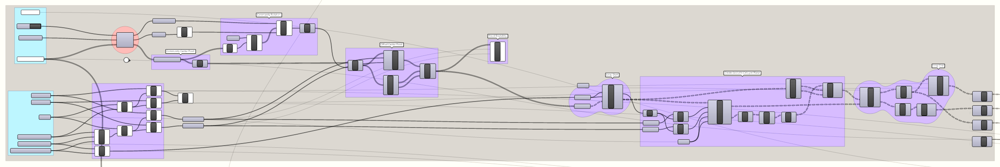

# A Fractal Community
### Building a Flexibile Model for Urban Visioning in Grasshopper
---

### Step One: Create dimensional module and fractal steps

#### Summary
This step will define the locations and rotations of the communities in the model. It will also determine the size and extent of the underlying fractal grid that will be used to construct the communities. 

####Inputs (Blue Groups)
- **Transit Paths** - A curve or list of curves representing the transit network connecting all communities in the model.
 - We will not use the Transit Paths in this step, but we set them now for convenience. They will be used in step three. 
- **Boolean Toggle** - Use the Primary Rotation supplied below if set to True. If False, a random rotation will be supplied. 
- **Primary Rotation** - A list of numbers representing degrees of rotation corresponding to each of the communities in the model. 
- **Community Centers** - A list of points representing the center point of each community.
- **Cell Prime (x)** - The base modular dimension of the x-axis.
- **Cell Prime (y)** - The base modular dimension of the y-axis.
- **Base** - The base number for the fractal doubling.
- **Room Exponent** - The exponent used to calculate the Room size from the Cell size.
- **Block Exponent** - The exponent used to calculate the Block size from the Room size.
- **Community Exponent** - The exponent used to calculate the Community size from the Block size.

#### A Primer on Fractals

"A fractal is a natural phenomenon or a mathematical set that exhibits a repeating pattern that displays at every scale. It is also known as expanding symmetry or evolving symmetry"

