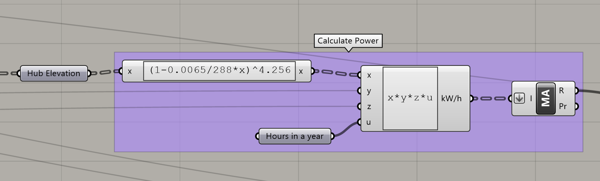
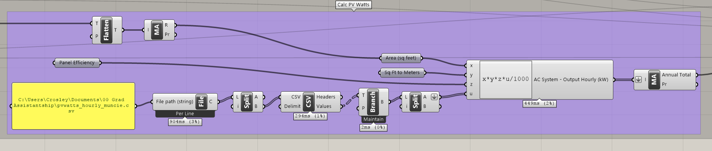
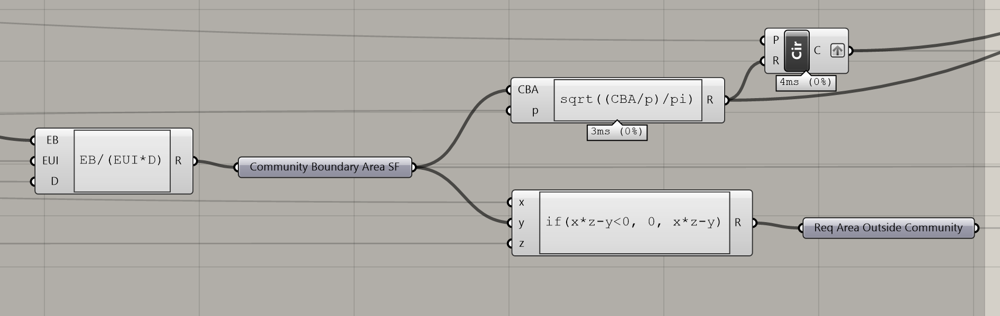

# A Fractal Community
## Building a Flexibile Model for Urban Visioning
---

### Step Three: Create a community boundary based on a given resource boundary

#### Summary
One of the overarching premises of this project is to create communities that are sustainable. This requires creating a resource budget to represent available resources, and then sizing the community so that consumption stays within that budget. 

This process requires a series of assumptions about the community that may need to be adjusted over the course of several iterations. This is because we must create a boundary before we design the community, and that design will determine the accuracy of the assumptions we made. 

In this chapter we will cover the calculation of electrical generation from PV panels as well as wind turbines. These calculations are estimations and will only be as accurate as the data we provide. 

Both the Wind and Solar Power calculations will be done again in Step 9 with actual data from the modeled community. Those calculations will be much more accurate. The metrics generated here should be considered preliminary.

#### Inputs

- **Target EUI** - EUI (Energy Use Intensity) is generally represented in kBTU/sf per year. In this model we will represent EUI in kWh/sf per year because the community will not utilize fossil fuels.
- **Target Density** - This variable represents the number of building floors desired in a given square footage of area.
- **Resource Radius** - The radius of the Resource Boundary. This boundary will be combined with % of Boundary to calculate the actual resource area.
- **% of Boundary** - The percentage of the resource circle that will be used for electrical generation.
- **Resource Boundary % Utilization** - The percentage of the actual resource area that will be used for PV panels.
- **Turbine Hub Height** - The height, from its base, of the hub of the referenced wind turbine.
- **Wind Speed** - A list of measured wind speeds from a .EPW weather file. 
- **Wind Speed Probability** - A list of probabilities, or percentage of total, corresponding to the list of wind speeds.
- **Power kW** - A list, corresponding to the list of wind speeds, of the power generated by the wind turbine at the given speed. 

### Wind Power
The first step of the Wind Power calculation determines the number of turbines that will be used. This is accomplished by projecting the resource boundary on the  model's topography. Then, the projected curve is contoured perpendicular to the wind direction at a specified interval. These intersection points will serve as the location and count of the wind turbines. They will also provide the elevation of the turbine hubs. 

Next we will use a method based on the [Wind Energy Payback Period Workbook](www.nrel.gov/wind/docs/spread_sheet_Final.xls) spreadsheet created by NREL, specifically the "Assumptions" tab. 

The following script calculates the Air Density Factor based on the elevation of the wind turbine hubs. This value is then multiplied by Wind Speed Probability, Power kW, and the number of hours in a year (8,766) to calculate annual kWh production by turbine and wind speed. These values are then summed to generate total annual wind power.

### Solar Power
The solar power calculation leverages hourly output data from [PVWatts](http://pvwatts.nrel.gov/). Input 1 as DC System Size and leave all other variables unchanged. On the Results page, below "User Comments" download Hourly Results. We will reference the resulting .CSV file. 

To calculate Hourly AC System Output in kW multiply Resource Area, Sq Ft to Meters coefficient, Panel Efficiency, and AC System Output from PVWatts. Sum the results to find Total Annual System Output. See below.

### A Target Boundary

Now that we have calculated the total electrical power generated by the resource boundary (Energy Budget) we can calculate the radius of the community and the difference between the community area and the resource area. The radius will be used to draw the community boundary. The difference in areas will be used in calculating the final power generation of the community. If the resource area is greater than the community area, then the difference represents the area outside the community required for power generation.

$$
Community\ Boundary\ Area\ (CBA) = {Energy\ Budget\over EUI\times Density}
$$

$$
Community\ Radius = \sqrt{{CBA/\%\ of\ Boundary}\over pi}
$$

lk