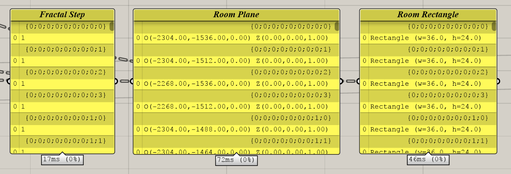

## Building a Flexibile Model for Urban Visioning 
---

### Step Four: Step down the fractal grid to create Blocks in an urban grid

#### Summary
This step will use the 'attractor point' method to group the rooms in the community into levels based on their distance from the center of the community. It will then use a looping function to step up the fractal pattern until the average of the room levels match the level of the step. 

#### Inputs
- Room Rectangles  
- Room Planes
- Radius of the Community Boundary
- Curve of the Community Boundary
- Block Exponent
- Community Exponent

### Calculate Steps
We calculate the distance from the center plane of each room to the center point of the community. If desired, the point could be at any location. Then remap these distances to a range of integers representing the desired number of steps up the tree each room would like to move.

### Step Up Loop
In Step 2 we built up a fractal grid. In this step we will loop through and merge branches from the bottom up to great larger groups of rooms. We will use the desired fractal step list just created to manipulate the Room Planes and Room Rectangles lists. This loop is simply a list management exercise. 

The challenge in this process is how to determine whether a group of a group of rooms should be merged together or not. We will 