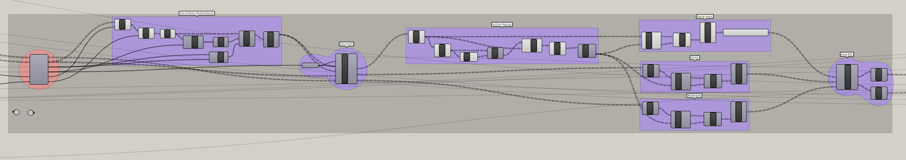
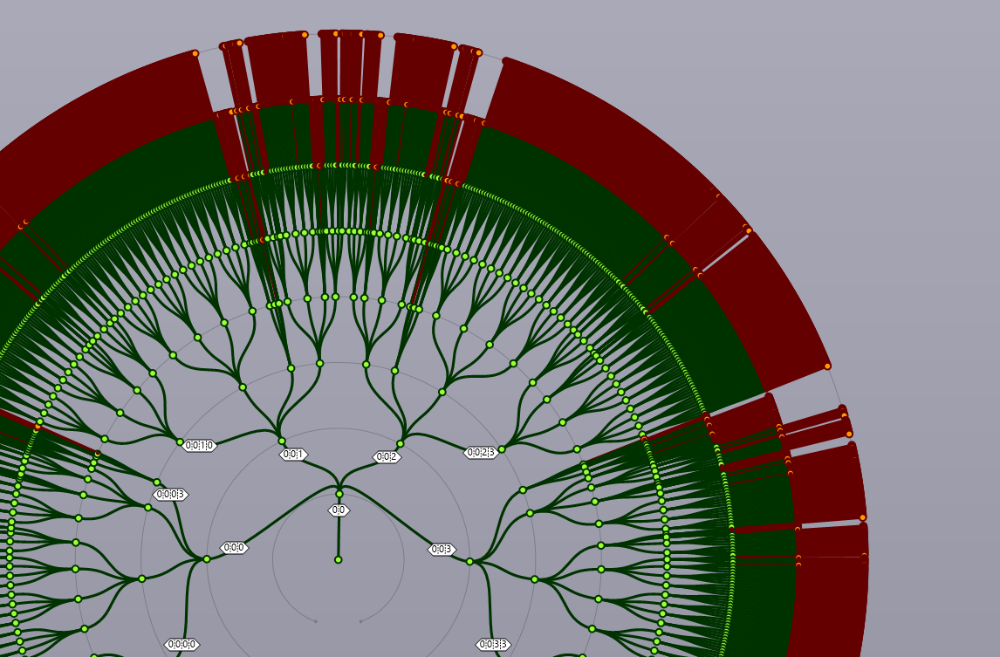

## Building a Flexibile Model for Urban Visioning 
---

### Step Four: Step down the fractal grid to create Blocks in an urban grid

#### Summary
This step will use the 'attractor point' method to group the rooms in the community into levels based on their distance from the center of the community. It will then use a looping function to step up the fractal pattern until the average of the room levels match the level of the step. 

#### Inputs
- Room Rectangles  
- Room Planes
- Radius of the Community Boundary
- Curve of the Community Boundary
- Block Exponent
- Community Exponent

### Calculate Steps
We calculate the distance from the center plane of each room to the center point of the community. If desired, the point could be at any location. Then remap these distances to a range of integers representing the desired number of steps up the tree each room would like to move.

### Step Up Loop
In Step 2 we built up a fractal grid. In this step we will loop through and merge branches from the bottom up to create larger groups of rooms. We will use the desired fractal step list just created to manipulate the Room Planes and Room Rectangles lists. This loop is simply a list management exercise. 

The challenge in this process is how to determine whether a group of a group of rooms should be merged together or not, and to perform the branch merging only on the required items. 

- Start by merging the lowest level of all three of the input lists above. 

- Then merge, again, the lowest level of the Desired Fractal Step list so that we have a pool of 16 rooms in the first recursion. We will average these values and replace the values in the list of averaged values with the original list (keeping the original list tree structure) so that they will be used in the next recursion.

Now, if a room has a value of 0 in the Desired Fractal Step list, it means that the room is at its desired location in the list, and if a room has a value of 1 it means that the room desires to be merged up one branch in the tree. With that understanding we will 

- Construct a Boolean statement such that: If the value in the Desired Fractal Step list is $$\geq$$ 1, then it is where it would like to be because we started the loop by merging the lowest level of all three lists. If the Boolean is false, then the room is actually one step above its desired branch. 

- Using this statement we will dispatch, graft the false values, merge, and clean all three lists. We will also subtract one from all values $$\neq 0$$ in the Desired Fractal Step list.

The end result is an asymmetrical data tree in which every group of rooms is at the desired level in the tree.

