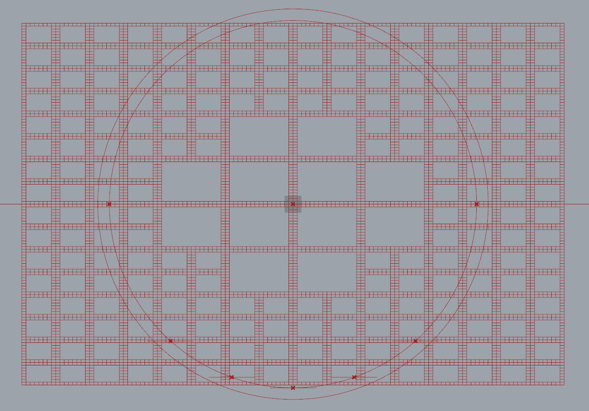
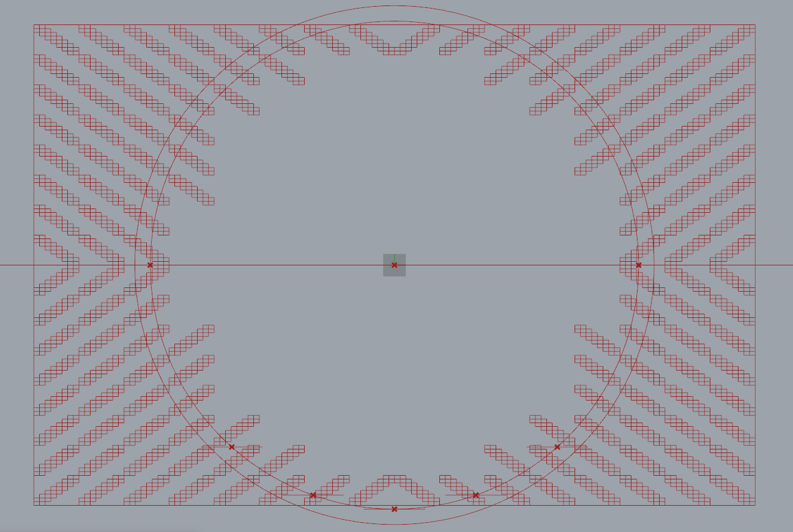
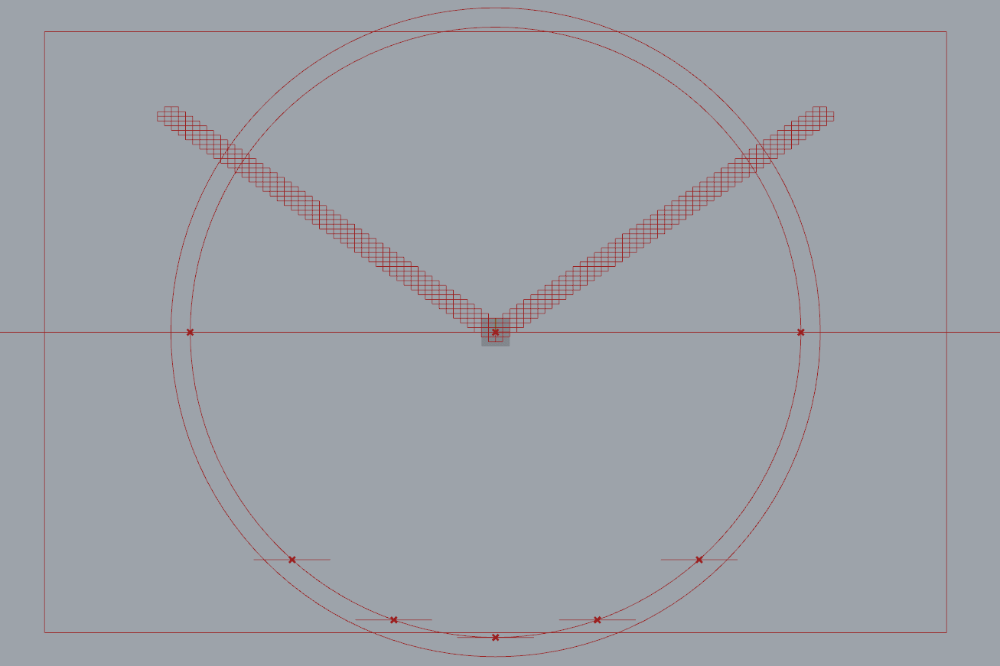
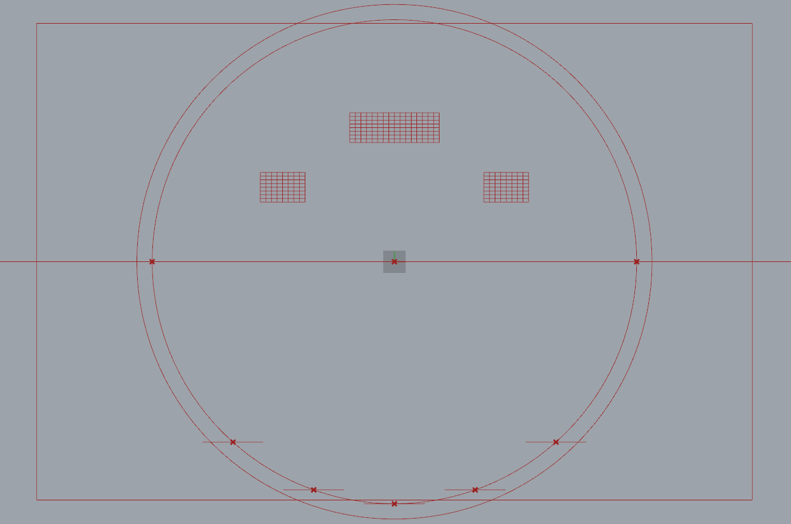
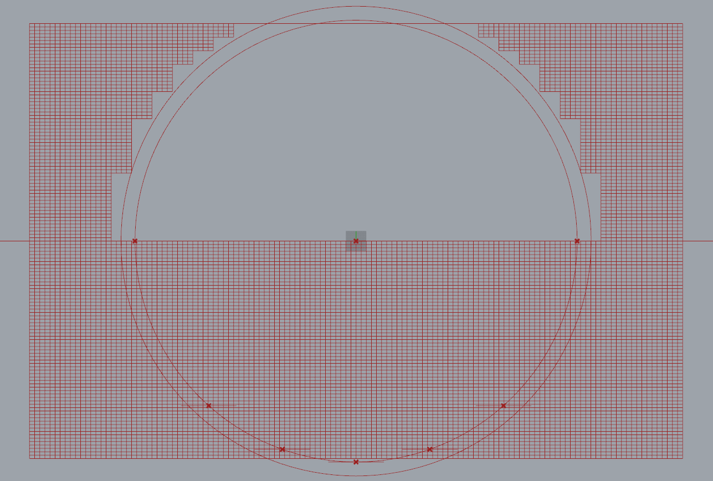
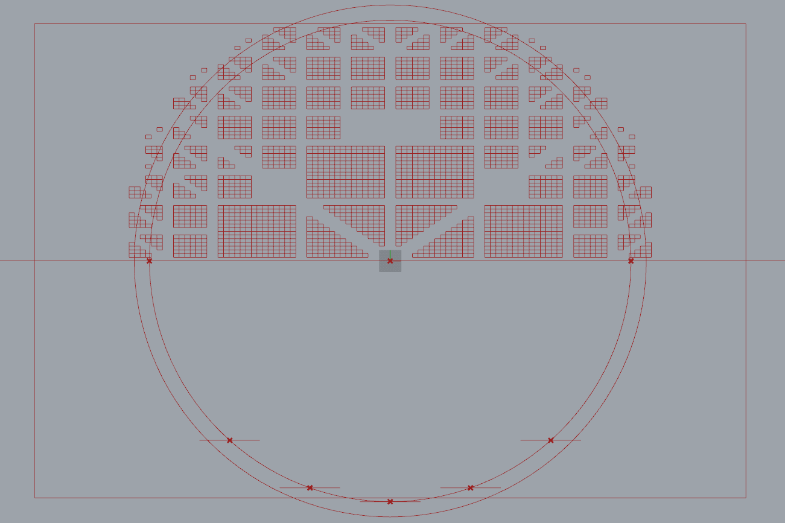

# A Fractal Community
## Building a Flexibile Model for Urban Visioning
---

### Step Five: Discard specific Rooms and Blocks

#### Summary
Until this point we have been manipulating data and tree structures in a fairly abstract way that is difficult to visualize. In this step we will discard the rooms in the urban grid that we are not interested in order to create a functional urban pattern.

#### Inputs
- Room Rectangles
- Room Center Plane
- Transit Curves
- Growth Boundary
- Total Steps - Room Exponent + Block Exponent + Community Exponent (use 9)
- Room X-axis Length
- Room Y-axis Length

### Block Boundary Rectangles
The previous step created the groups of rooms that represent individual blocks. Now, we will create boundary rectangles to represent those blocks. We calculate the fractal step of the block by finding the length of the branch path for each block (because each iteration of the fractal pattern creates an additional branch). Then use the formula outlined in step one to calculate the dimensions of the rectangle.

### Pathways
One set of rooms we would like to discard are the rooms along the boundary rectangles in order to create a street grid. Take two opposite corners of each room and test if those points fall on the boundary curve for that rooms block. Then, create a Boolean OR statement that will be True if either point touches the curve.

### Internal Alleys
Next we will create internal alleys. This step will involve creating a diagonal internal pathway instead of creating four smaller blocks. We will target this pattern explicitly to the smallest fractal step that would otherwise result in a 4x4 grid. 

We need to create a diagonal path through the block, but the alley should always be directed towards a point we specify, in this case the center of community. We will find the list index value of the corner point for each block that is closest to the specified point. Shift the list of corner points so that point becomes item 0. Then select items 0 and 2 from the list of points and create a line. Discard all rooms whose center points are within a specified distance of the alley curve. The discarded rooms are shown below.

### Arbitrary Pathways
This is a simple attractor point problem. We would like to discard all rooms with center points within a specified distance to a set of arbitrary curves. Arbitrary in the sense that they are not inherently based on the fractal patterning but rather on some outside logic, in this case to create a series of Grand Boulevards.

### Courtyards
Another simple sorting problem. Discard all blocks with center points within a set of closed curves. This test could also be applied at the room level to create more complex courtyard shapes.

### Growth Boundary
This test is essentially the courtyard test, but it modified specifically to create the growth boundary.

### Dispatch by NOR
The final step in this process is to combine all of tests in one additive test. It is important that all of the tests return the desired rooms as False because False = 0 and we must sum all of the tests for each room such that $$\sum tests=0 $$. The rooms that return True are the rooms to keep.

