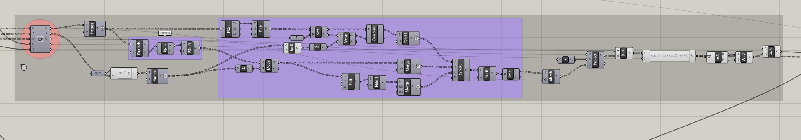

# A Fractal Community
## Building a Flexibile Model for Urban Visioning
---

### Step Seven: Construct rooftop articulation

#### Summary
This step will calculate the number of stories for each room in the block that are needed to create the desired rooftop articulation. 

#### Inputs
- Block Rectangles 
- Block Fractal Step
- Room Center Points
- Floor to Floor Height
- Actual Floor Area Budget

