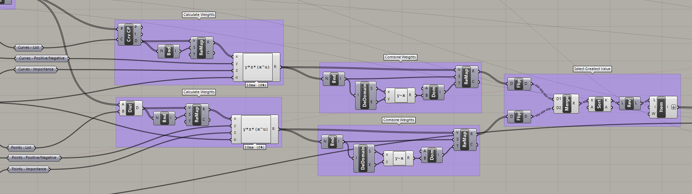

# A Fractal Community
## Building a Flexibile Model for Urban Visioning
---

### Step Eight: Layer Block levels to meet target density

#### Summary
This step will calculate the required remaining number of stories for each Block or Room to meet the total Actual Floor Area Budget. 

#### Inputs
**Model inputs:**
- Remainder Floor Area Budget
- Block Center Points
- Room Center Points
- Room Rectangles

**Variable Inputs:**
- Minimum Stories per Block
- Width of Distribution Range
- Calculate Stories by Block or Room (Boolean)

**Density Inputs:** an number of the following sets of variables
- Curve for Density
- Curve - Corresponding Signs (+ / -)
- Curve - Corresponding Importance Weights

*or*
- Point for Density
- Point - Corresponding Signs (+ / -)
- Point - Corresponding Importance Weights

### Calculate and Combine Weights

Calculate distances, remap to `0 to 1` and apply sign and importance variables. Remap the result to be positive while maintaining the width of the domain by subtracting the End of the domain from the Start. Flip the matrix of the list so that `{A}(i)` becomes `{i}(A)`, merge the point and curve lists and select the greater value for each. 

This has combined all of the distance values for the density inputs by Block and selected the highest value. There are other techniques like averaging that may also be used. 

### Shift with Galapagos and Normalize to Range
Now that each Block has a priority value or importance factor to determine its height we need to scale those values proportionately so that the total density meets the Remainder Floor Area Budget. To accomplish this we will take the values for each block to a power determined by the Galapagos solver. After this, we remap those numbers to a range that represents the range of building heights, such as `0 to 8`.

### Stats
Now that we have determined the number of stories for each block, it is useful to calculate some statistics to understand the data we have created. We calculate the Error percentage which represents:
$$
Error\ \% = {Actual\ Area - Target\ Area \over Target\ Area}
$$

This value is used as the optimization parameter for Galapagos. It will manipulate the exponent slider to find the value that results in the lowest Error %. Second, we calculate the Average # of Stories which will be added to the block. We also calculate the Standard Deviation of stories across the community. 

$$
Standard\ Deviation = \sqrt {\Sigma (x_i - \overline{x})^2 \over n}
$$

Variables:

$$x_i = Individual\ Block\ Values $$

$$\overline{x}= Average\ of\ Block\ Values$$

$$n = Number\ of\ Blocks\ in\ the\ Community$$