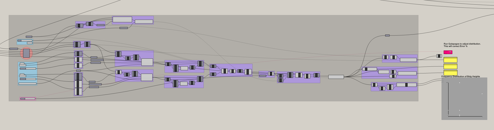

# A Fractal Community
## Building a Flexibile Model for Urban Visioning
---

### Step Eight: Layer Block levels to meet target density

#### Summary
This step will calculate the required remaining number of stories for each Block or Room to meet the total Actual Floor Area Budget. 

#### Inputs
**Model inputs:**
- Remainder Floor Area Budget
- Block Center Points
- Room Center Points
- Room Rectangles

**Variable Inputs:**
- Minimum Stories per Block
- Width of Distribution Range
- Calculate Stories by Block or Room (Boolean)

**Density Inputs:** an number of the following sets of variables
- Curve for Density
- Curve - Corresponding Signs (+ / -)
- Curve - Corresponding Importance Weights

*or*
- Point for Density
- Point - Corresponding Signs (+ / -)
- Point - Corresponding Importance Weights

### Calculate and Combine Weights

Calculate distances, remap to `0 to 1` and apply sign and importance variables. Remap the result to be positive while maintaining the width of the domain by subtracting the End of the domain from the Start. Flip the matrix of the list so that `{A}(i)` becomes `{i}(A)`, merge the point and curve lists and select the greater value for each. 

### Shift with Galapagos and Normalize to Range

### Stats

